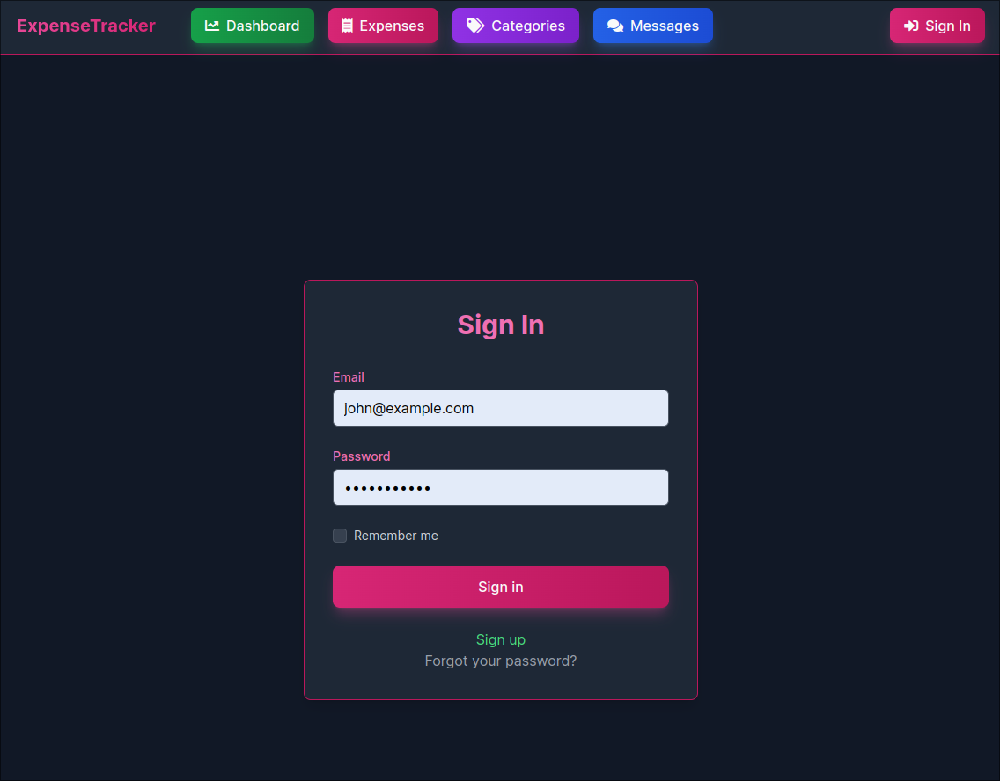
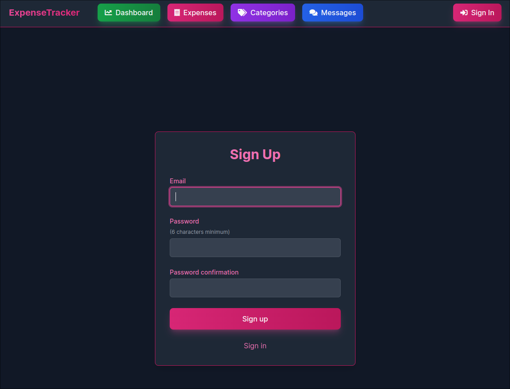
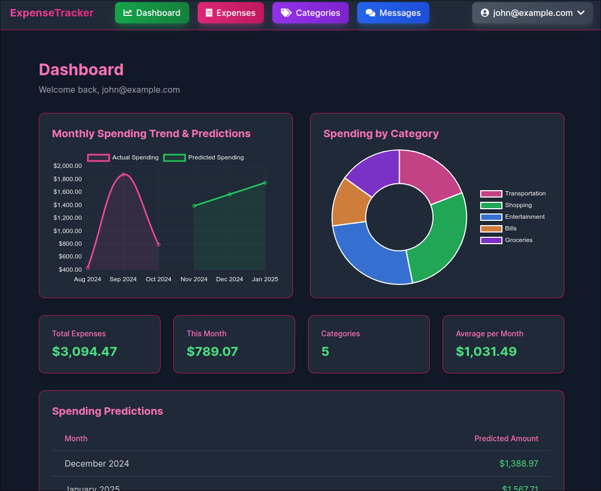
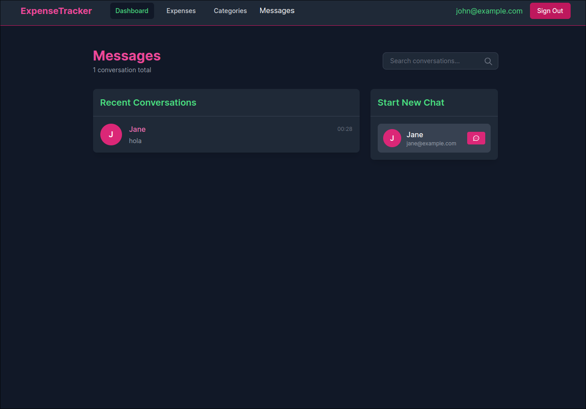
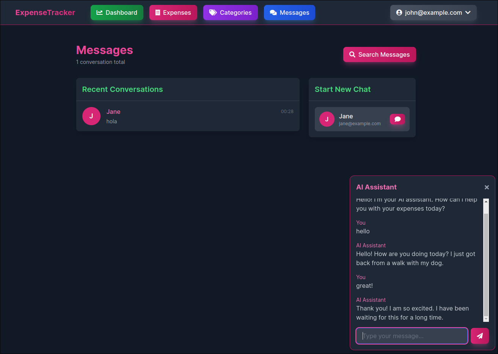
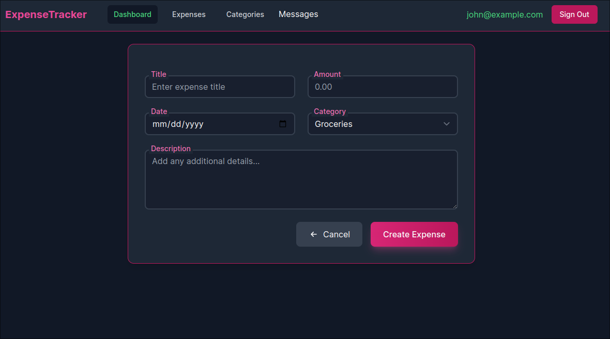
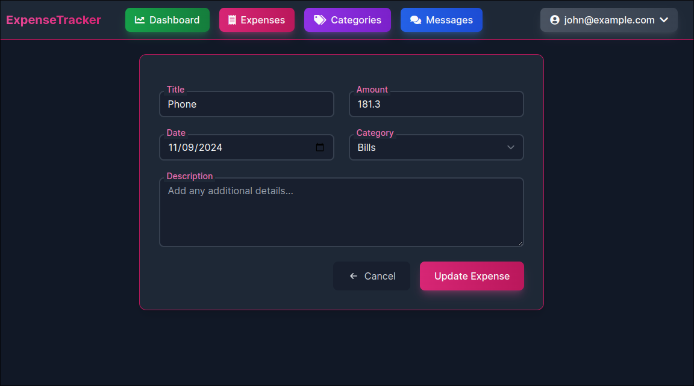
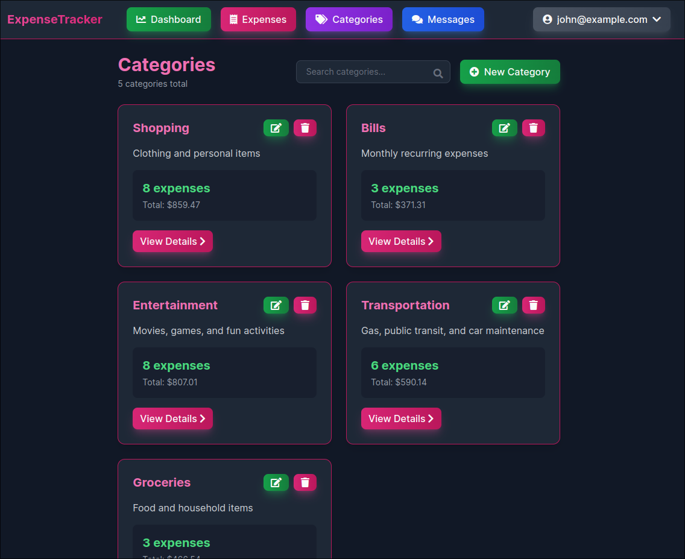
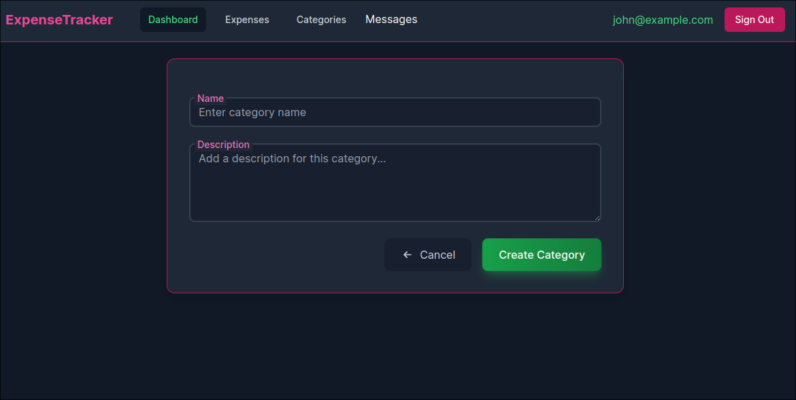
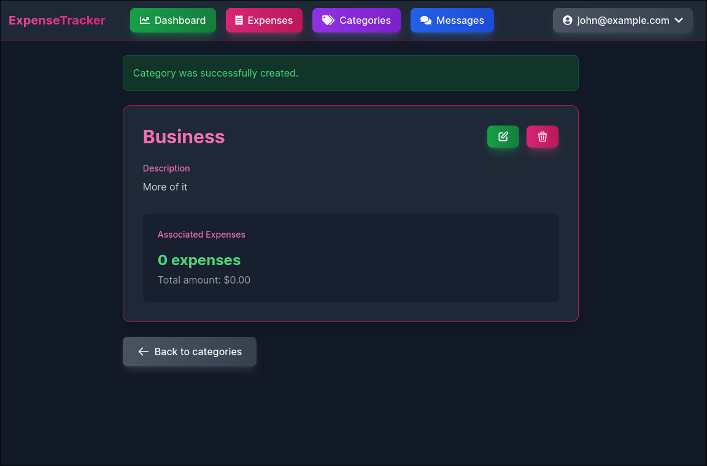

# Expense Management Application

[](https://github.com/andrewsheelan/expenses/actions/workflows/ci.yml)
[](https://github.com/rubocop/rubocop)
[](https://www.ruby-lang.org/en/)
[](https://rubyonrails.org/)
[](https://opensource.org/licenses/MIT)

A modern expense tracking application built with Ruby on Rails, featuring real-time chat functionality, AI assistance, and beautiful (glossed) dark-themed UI.

## Features

### Screenshots

#### Sign-in:


#### Sign-up:


#### Dashboard:


#### Messages:


#### Conversations:



#### Expenses:




#### Categories:




## Key Features

### Expense Management
- Track personal expenses with categories
- Monthly spending analytics
- Spending predictions using linear regression
- Interactive charts and visualizations
- Category-wise expense distribution
- Detailed expense history

### Real-time Chat with AI Assistant
- Instant messaging between users
- Real-time message updates using Action Cable
- Beautiful chat interface with message timestamps
- Support for multiple conversations
- Local timezone display for messages
- AI-powered chat assistant for expense-related queries
- Intelligent responses using Hugging Face's language models
- Real-time AI interactions in a floating chat widget

### User Authentication & Security
- Secure user registration and login
- Password reset functionality with email notifications
- Protected routes and resources
- User-specific data isolation
- Remember me functionality
- Secure API key management for AI services

### Modern UI/UX
- Beautiful dark theme throughout
- Responsive design for all screen sizes
- Interactive charts and graphs
- Smooth animations and transitions
- Tailwind CSS for styling
- User-friendly forms and navigation
- Floating AI chat widget

## Technical Stack

### Backend
- Ruby 8.0.0
- Rails 8.0.0
- PostgreSQL database
- Action Cable for WebSocket
- Devise for authentication
- Linear regression for predictions
- Hugging Face API integration for AI chat

### Frontend
- Tailwind CSS for styling
- Hotwire for dynamic updates
- Chart.js for visualizations
- JavaScript for interactivity
- Responsive design
- Stimulus.js for AI chat interactions

### Testing & Quality
- RSpec for testing
- RuboCop for code style
- GitHub Actions for CI
- Test coverage tracking
- SimpleCov for coverage reports

## Setup Instructions

### Basic Setup
1. Clone the repository
```bash
git clone https://github.com/andrewsheelan/expenses.git
cd expenses
```

2. Install dependencies
```bash
bundle install
yarn install
```

3. Setup database
```bash
rails db:create db:migrate db:seed
```

4. Start the server
```bash
bin/dev
```

### AI Chat Setup
1. Sign up for a Hugging Face account at https://huggingface.co/
2. Go to your profile settings and navigate to "Access Tokens"
3. Create a new token with "read" access
4. Edit your Rails credentials:
   ```bash
   EDITOR="vim" rails credentials:edit
   ```
5. Add your Hugging Face API key:
   ```yaml
   huggingface:
     api_key: your_api_key_here
   ```
6. Restart your Rails server

## Usage

### AI Chat Assistant
The AI chat assistant is available on the conversations page as a floating widget. You can:
- Ask questions about your expenses
- Get insights about your spending
- Request help with expense categorization
- Get explanations about financial terms
- Receive suggestions for expense management

The AI assistant uses Hugging Face's language models to provide intelligent responses based on your queries.

## Getting Started

Visit `http://localhost:3000` and create an account to get started!

## Contributing
1. Fork the repository
2. Create your feature branch (`git checkout -b feature/amazing-feature`)
3. Commit your changes (`git commit -m 'Add some amazing feature'`)
4. Push to the branch (`git push origin feature/amazing-feature`)
5. Open a Pull Request

## License
This project is licensed under the MIT License - see the [LICENSE](LICENSE) file for details.

## Acknowledgments
- [Ruby on Rails](https://rubyonrails.org/)
- [Tailwind CSS](https://tailwindcss.com/)
- [Chart.js](https://www.chartjs.org/)
- [Devise](https://github.com/heartcombo/devise)
- [Action Cable](https://guides.rubyonrails.org/action_cable_overview.html)
- [Hugging Face](https://huggingface.co/)
